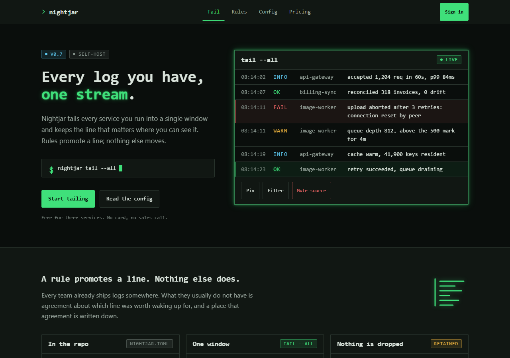

<!-- The screenshot above is a real render of demo/index.html, not a mock. If you
     change the demo, regenerate it in the same run or this README starts lying.
     From the repository root:

       npx --yes playwright screenshot --viewport-size="1280,900" \
         --wait-for-timeout=300 "file://$(pwd)/demo/index.html" assets/hero.png

     On Windows under Git Bash, use $(pwd -W) so the file URL carries the drive
     letter.

     The capture is deterministic: three consecutive runs of the command above
     produced the same SHA-256, and the committed PNG is that hash,
     60d7bb7d7cd2d345ed2697a82dd84e04c43dfaefafecae3809558e1cf468f399.

     The timeout is load-bearing, which is unusual and worth knowing. This theme
     has one animation, the cursor blink, and it is a step-end switch on a
     1060ms cycle that is on for the first 530ms. Any wait inside that first
     half captures the cursor drawn; a wait past it captures the cursor gone,
     and the PNG changes. 300ms sits in the on half with 230ms of margin. If you
     want more margin, use a smaller timeout rather than a larger one. -->

A dark register for developer tools, rooted in the terminal. This is the web aesthetic: near-black grounds, monospace as the display voice, one phosphor accent, and glow used as emphasis. It is not a TUI library. If you came here for a toolkit that draws interfaces inside a terminal emulator, in the way that ncurses, Textual, Bubble Tea and ratatui do, this is the wrong repository and nothing here will help you.

No scanlines, no CRT curvature, no flicker. Those effects are a costume worn over the register rather than the register itself, and they are the fastest way to make a serious tool look like a novelty.

## The demo

The screenshot above is [`demo/index.html`](demo/index.html), a fictional log-tailing product called Nightjar. **[Open it live](https://rampstackco.github.io/terminal-ui-theme/demo/)**, or clone the repo and open the file. There is no build step, no framework, no `node_modules`, and no server to start.

The demo declares no color of its own. It links `tokens/tokens.css`, `components/components.css` and `components/glow.css` and reads every value from them, so it stays honest about what the theme actually produces.

There is a second page worth opening: [`components/index.html`](components/index.html) renders all six components with their variants and the markup to copy.

## Position map

A visual style is a set of coordinates, not a mood. This theme sits at one point in the [creative direction framework](https://rampstack.co/framework/creative-direction), which sets brand direction on four axes. Here is where this register lands and what each choice pays for.

| Axis | Position | What the position buys |
| --- | --- | --- |
| Tone register | [Professional](https://rampstack.co/framework/tone/professional) | A voice that assumes the reader has done this before. No exclamations, no hype, and a heading that states the thing rather than selling it. |
| Aesthetic philosophy | [Editorial Restrained](https://rampstack.co/framework/aesthetic/editorial-restrained) | A base, one accent, and a hairline. Type carries the page because there is nothing else on it, which is what lets four hundred rows stay readable. |
| Audience relationship | [Peer](https://rampstack.co/framework/relationship/peer) | Sharp corners and an unexplained `--all` flag. The interface assumes literacy rather than teaching it. |
| Sensory ambition | [Considered](https://rampstack.co/framework/sensory/considered) | Glow as emphasis rather than as atmosphere. The reader notices the craft; they do not get a mood piece about the 1980s. |

Those four position names are the exact strings the framework uses. If you want the long version of any of them, the links go to the position page.

One of those four strains, and it is worth naming rather than hiding. Editorial Restrained is written around generous space, and a log pane is the densest thing on the web. What this register borrows from the position is the color discipline and the refusal to add an element that has not earned its place; what it declines is the space. If you want the position at its usual density, the move is in [CUSTOMIZE.md](CUSTOMIZE.md).

## Quick start

Clone once, then pick the path that matches your stack.

```bash
git clone --depth 1 https://github.com/rampstackco/terminal-ui-theme
```

**Plain CSS.** Copy the two directories and link them in order. This is the whole install.

```bash
cp -r terminal-ui-theme/tokens terminal-ui-theme/components your-project/styles/
```

```html
<link rel="stylesheet" href="/styles/tokens/tokens.css" />
<link rel="stylesheet" href="/styles/components/components.css" />
<link rel="stylesheet" href="/styles/components/glow.css" />
```

The third line is optional. Leaving it out gives you the quiet variant, described below.

**Tailwind v4.** One import. `theme.css` pulls in `tokens.css` and maps it onto Tailwind's theme namespaces, so you get `bg-term-ground`, `text-shadow-term-glow`, `border-term`, `text-term-h1`.

```css
@import "tailwindcss";
@import "./styles/tokens/theme.css";
```

**Tailwind v3.** Load the tokens in your stylesheet, then register the preset.

```css
@import "./styles/tokens/tokens.css";
@tailwind base;
@tailwind components;
@tailwind utilities;
```

```js
// tailwind.config.js
module.exports = {
  presets: [require("./styles/tokens/preset.js")],
  content: ["./src/**/*.{html,js,jsx,ts,tsx}"],
};
```

**Already on shadcn/ui.** The tokens are namespaced `--term-*` so they will not clobber yours. Bridge the two in your global stylesheet and shadcn's components inherit the register:

```css
:root {
  --background: var(--term-ground);
  --foreground: var(--term-ink);
  --card: var(--term-surface);
  --muted: var(--term-surface-raised);
  --muted-foreground: var(--term-ink-muted);
  --primary: var(--term-accent);
  --primary-foreground: var(--term-accent-ink);
  --destructive: var(--term-status-fail);
  --border: var(--term-line);
  --ring: var(--term-ring);
  --radius: var(--term-radius);
}
```

## Where the reasoning lives

[`tokens/tokens.css`](tokens/tokens.css) is the single source of truth. Every literal value in the theme appears there exactly once; `theme.css` and `preset.js` hold no values of their own and point back at it with `var()`. Change a hex there and the demo, the components, and both Tailwind adapters follow.

The file is annotated. Each group of tokens carries a comment naming the axis the choice serves and why, so the glow tokens explain themselves:

```css
/* GLOW
   Sensory ambition axis, and the emphasis system this register runs on in
   place of shadow. A dark ground gives a shadow nothing to fall on, so
   emphasis has to be additive: the emphasized thing emits rather than casts. */
```

[`tokens/theme.css`](tokens/theme.css) carries a verification header rather than a description. Every namespace in the v4 adapter was compiled and read back, because an entry filed under a namespace Tailwind does not process raises no error and produces no utility, so an adapter can look complete and ship nothing. Three of the fourteen namespaces this theme uses are absent from Tailwind's documented namespace table; they work, they are flagged, and each has a compiled escape route. The header also records a wrong assumption the harness caught, which is the reason it exists.

[`CUSTOMIZE.md`](CUSTOMIZE.md) is the half-finished layer, and it is half-finished deliberately. It documents retheming as axis moves rather than as a color picker: pick an axis, move along it, change the two or three tokens that carry the move. Two moves are worked through with before and after values. Two more are sketched so the format is obvious enough to finish yourself.

### The glow layer

Tokens can hold a color and a length. They cannot hold the rule that says a glow at 12px closes the counters of the letterforms and costs more legibility than the emphasis buys. That layer lives in [`assets/`](assets/) and [`components/glow.css`](components/glow.css), and it is deliberately separable from everything else.

`glow.css` carries three things. The two glow tiers, text and edge, both built on `currentColor` so one pair of declarations serves every status: a failing row glows red and a passing row glows phosphor without a per-status token. The prompt and cursor motifs, which are the two marks that say terminal without a single scanline. And six numbered legibility rules for dense dark UI, written out with the contrast figures, because dark themes fail AA constantly and solving that visibly is what this repo is for. The shortest of the six: a dark theme has three grounds, and the raised one is the least forgiving, so a theme measured only against the page background passes its own audit and still fails inside a hovered row.

`assets/` holds five original SVGs: two prompt marks, a block cursor, and two larger glyphs used as section marks. They are built to be inlined into your markup rather than loaded through ``, because an SVG inside an `` is an isolated document that cannot read your custom properties. Inlined, the paint rules in `glow.css` reach them and they take your token colors. Opened on their own they stay legible as line art.

Delete `assets/` and `glow.css` and everything still works, quietly. That deletion is not damage, it is a move along the sensory ambition axis from [Considered](https://rampstack.co/framework/sensory/considered) toward [Functional](https://rampstack.co/framework/sensory/functional), and [CUSTOMIZE.md](CUSTOMIZE.md) documents it as the quiet variant.

**Consuming this from a Claude skill.** The [`design-standards`](https://github.com/rampstackco/claude-skills/tree/main/skills/design-standards) skill asks for a project's design tokens as a required input and offers to define a working set when none exist. Point it at `tokens/tokens.css` instead. The file already covers every category the skill asks for, in the order it asks: color with measured contrast ratios, spacing scale, type scale, radius. Every text pairing in it clears WCAG AA against all three grounds, and the ratios are in the comments so the skill's contrast pass has nothing left to compute.

## Adjacency: the polished pole and the root

This register has a wide family, and two ends of it are worth naming because they are what people are usually pointing at.

At the root is the hardware terminal and the shells that came after it: fixed cells, a prompt, one phosphor color because the tube only had one. Everything in this repo descends from that, including the decision to let color mean something, which a terminal made out of necessity and this theme keeps on purpose.

At the polished pole is the register Linear popularised: near-black grounds, tight type, a single accent, restraint everywhere. That end has largely dropped the monospace display voice, which is the fork in the family. Keeping monospace for headings is the decision that tells a reader what kind of software they are looking at before they have read a word, and it is the one thing here that does not survive being softened.

Real products mix registers rather than adopting one whole, and translucent surfaces layered over a dark ground are the most common addition to this one. Those effects live in [glassmorphism-theme](https://github.com/rampstackco/glassmorphism-theme) rather than here, so composing the two is intended use. That repo's ground is built for this case, a dark base with light behind it, which is what a terminal palette already is.

The other dev-native register in this collection is [neobrutalism-theme](https://github.com/rampstackco/neobrutalism-theme), and the two sit at the same relationship position and the same sensory ambition while disagreeing on the other two axes: neobrutalism is loud and amused where this one is quiet and precise. Same reader, same distance from them, opposite volume.

## This is a register, and the shells are a different thing

Four repositories in this collection are **shells** rather than registers, and the distinction is the one most likely to send someone to the wrong repo.

This repo is a register: a surface any ordinary page can wear. Your markup stays a page, and the theme changes what it looks like. A shell is a structure your site lives inside: it ships a window manager or a board, a taskbar or a dock, an enhancement contract and a focus model, and the register it wears is swappable. The two compose, and a shell wearing something close to this register is a normal thing to want.

The one worth naming here is [game-console-ui-theme](https://github.com/rampstackco/game-console-ui-theme), because "terminal UI" and "console UI" are close enough in words to be far apart in fact. That repo is a room-scale board of tiles driven by arrow keys, on a dark ground, for a reader holding a remote control. It is not a console in this repo's sense of the word. If you want a page that looks like a terminal, you are in the right repo. If you want a site that behaves like a machine, the shells are [desktop-os-theme](https://github.com/rampstackco/desktop-os-theme) (the class's pilot, and where its [class-decision log](https://github.com/rampstackco/desktop-os-theme/blob/main/docs/class-decisions.md) lives), [retro-desktop-theme](https://github.com/rampstackco/retro-desktop-theme), [phone-launcher-theme](https://github.com/rampstackco/phone-launcher-theme) and game-console-ui-theme.

## License and questions

MIT. See [LICENSE](LICENSE). Use it commercially, fork it, rename the tokens, ship it. No attribution required.

Issues and pull requests are welcome here. For questions, ideas, and anything conversational, use [the discussions on the claude-skills repo](https://github.com/rampstackco/claude-skills/discussions), which is where all discussion for these repos lives.
